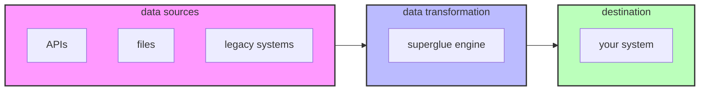

<p align="center">
  
</p>

<h1 align="center">data that speaks your language 🍯</h1>

superglue translates data from external systems into exactly the format you need. It's an open source proxy that automatically extracts, maps and transforms data so developers don't have to write and maintain complex integration code.

- 🔮 One-off LLM-powered translations: Generate deterministic, high-performance translation code.
- 🩹 Self-healing: Detect format changes and update translations automatically.
- 🚀 Fast deployment: Supports most APIs and data formats out of the box.


<div align="center">

[](https://github.com/superglue-ai/superglue/blob/main/LICENSE)
[](https://www.ycombinator.com/companies/superglue)
[](https://www.npmjs.com/package/@superglue/client)
[](https://hub.docker.com/r/superglueai/superglue)
[](https://twitter.com/adinagoerres)
[](https://twitter.com/sfaistenauer)


</div>




## quick start
### hosted version

1. Sign up for early access to the hosted version of superglue at [superglue.cloud](https://superglue.cloud)

2. Install the superglue js/ts client:
```bash
npm install @superglue/client
```

3. Configure your first api call:
```javascript
import { SuperglueClient } from "@superglue/client";

const superglue = new SuperglueClient({
  apiKey: "************"
});

const config = {
  urlHost: "https://futuramaapi.com",
  urlPath: "/graphql",
  instruction: "get all characters from the show",
  responseSchema: {
    type: "object",
    properties: {
      characters: {
        type: "array",  
        items: {
          type: "object",
          properties: {
            name: { type: "string" },
            species: { type: "string", description: "lowercased" }
          }
        }
      }
    }
  }
};

const result = await superglue.call({endpoint: config});
console.log(JSON.stringify(result.data, null, 2));

/*
output:
{
  "characters": [
    {
      "name": "Phillip J. Fry",
      "species": "human"
    },
    ...
  ]
}
*/
```

### self-hosted version

Run your own instance of superglue using Docker:

1. Pull the Docker image:
```bash
docker pull superglueai/superglue
```

2. Create a `.env` file with the following configuration:
```env
# Server Configuration

# Port to run the superglue server
GRAPHQL_PORT=3000

# Port to run the web dashboard 
WEB_PORT=3001

# Endpoint the web interface will connect to
GRAPHQL_ENDPOINT=http://localhost:3000

# Authentication token for API access
AUTH_TOKEN=your-auth-token

# Datastore Configuration. Memory is faster but not persistent. Redis is slower but persistent. File is a simple persistent option.
DATASTORE_TYPE=redis or memory or file
# if redis
REDIS_HOST=localhost
REDIS_PORT=6379
REDIS_USERNAME=default
REDIS_PASSWORD=secret
# if file
STORAGE_DIR=/data

# OpenAI Configuration
OPENAI_API_KEY=sk-...
# OpenAI model to use. We recommend gpt-4o-2024-11-20
OPENAI_MODEL=gpt-4o-2024-11-20
```

3. Start the server:
```bash
docker run -d \
  --name superglue \
  --env-file .env \
  -p 3000:3000 \
  -p 3001:3001 \
  superglueai/superglue
```

4. Verify the installation:
```bash
curl http://localhost:3000/health
> OK

# or open http://localhost:3000/?token=your-auth-token
```

5. Open the dashboard to create your first configuration:
```bash
http://localhost:3001/
```

6. run your first call:
```bash
npm install @superglue/client
```

```javascript
import { SuperglueClient } from "@superglue/client";

const superglue = new SuperglueClient({
  endpoint: "http://localhost:3000",
  apiKey: "your-auth-token"
});

// either via config object
const config = {
  urlHost: "https://futuramaapi.com",
  urlPath: "/graphql",
  instruction: "get all characters from the show",
};

const result = await superglue.call({endpoint: config});

// or via the api id if you have already created the endpoint
const result2 = await superglue.call({id: "futurama-api"});

console.log(JSON.stringify(result.data, null, 2));
```


## key features

- **LLM-Powered Data Mapping**: Automatically generate data transformations using large language models
- **API Proxy**: Intercept and transform API responses in real-time with minimal added latency
- **File Processing**: Handle various file formats (CSV, JSON, XML) with automatic decompression
- **Schema Validation**: Ensure data compliance with your specified schemas
- **Flexible Authentication**: Support for various auth methods including header auth, api keys, oauth, and more
- **Smart Pagination**: Handle different pagination styles automatically
- **Caching & Retry Logic**: Built-in caching and configurable retry strategies

## 📖 Documentation

For detailed documentation, visit [docs.superglue.cloud](https://docs.superglue.cloud).

## 🤝 contributing
We love contributions! Feel free to open issues for bugs or feature requests.

[//]: # (To contribute to the docs, check out the /docs folder.)

## license

superglue is GPL licensed. The superglue client SDKs are MIT licensed. See [LICENSE](LICENSE) for details.

## 🙋‍♂️ support

- 💬 Discord: [Join our community](https://discord.gg/vUKnuhHtfW)
- 🐛 Issues: [GitHub Issues](https://github.com/superglue-ai/superglue/issues)

[](https://twitter.com/superglue_d)

