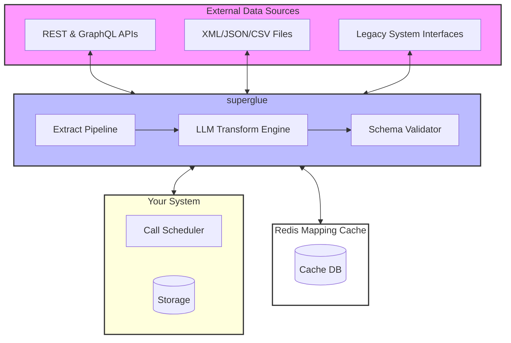

# welcome to superglue 🍯

superglue is an API translator. 
let it extract, map and transform data into exactly the format your system needs. with superglue, you can automate data extraction & transformation from any source.

- **lightweight ETL**
- **one line of code to integrate**

## key features

- **LLM-Powered Data Mapping**: Automatically generate data transformations using large language models
- **API Proxy**: Intercept and transform API responses in real-time with minimal added latency
- **File Processing**: Handle various file formats (CSV, JSON, XML) with automatic decompression
- **Schema Validation**: Ensure data compliance with your specified schemas
- **Flexible Authentication**: Support for various auth methods including header auth, api keys, oauth, and more
- **Smart Pagination**: Handle different pagination styles automatically
- **Caching & Retry Logic**: Built-in caching and configurable retry strategies

[](https://github.com/superglue-ai/superglue/blob/main/LICENSE)
[](https://github.com/superglue-ai/superglue/stargazers)
[](https://www.npmjs.com/package/@superglue/superglue)
[](https://hub.docker.com/r/superglueai/superglue)
[](https://discord.gg/SKRYYQEp)

## common use cases

- Unify supplier and customer data from multiple sources into a consistent format
- Connect legacy systems to modern applications by transforming their data formats in real-time
- Standardize log and transaction data from multiple sources

## getting Started
### hosted version

1. Sign up for early access to the hosted version of superglue at [superglue.cloud](https://superglue.cloud)

2. Install the superglue js/ts client:
```bash
npm install @superglue/superglue
```

3. Configure your first api call:
```javascript
import { SuperglueClient } from "@superglue/superglue";

const superglue = new SuperglueClient({
  apiKey: "************"
});

const config = {
  urlHost: "https://futuramaapi.com",
  urlPath: "/graphql",
  instruction: "get all characters from the show",
  responseSchema: {
    type: "object",
    properties: {
      characters: {
        type: "array",  
        items: {
          type: "object",
          properties: {
            name: { type: "string" },
            species: { type: "string", description: "lowercased" }
          }
        }
      }
    }
  }
};

const result = await superglue.call({endpoint: config});
console.log(JSON.stringify(result.data, null, 2));

/*
output:
{
  "characters": [
    {
      "name": "Phillip J. Fry",
      "species": "human"
    },
    ...
  ]
}
*/
```

### self-hosted version

Run your own instance of superglue using Docker:

1. Pull the Docker image:
```bash
docker pull superglueai/superglue
```

2. Create a `.env` file with the following configuration:
```env
# Server Configuration
GRAPHQL_PORT=3000             # Port to run the superglue server
WEB_PORT=3001                 # Port to run the web dashboard 
AUTH_TOKEN=your-auth-token    # Authentication token for API access

# Datastore Configuration. Memory is faster but not persistent. Redis is slower but persistent.
DATASTORE_TYPE=redis or memory
# if redis
REDIS_HOST=localhost          # Redis server hostname
REDIS_PORT=6379               # Redis server port
REDIS_USERNAME=default        # Redis username
REDIS_PASSWORD=secret         # Redis password

# OpenAI Configuration
OPENAI_API_KEY=sk-...         # Your OpenAI API key
OPENAI_MODEL=gpt-4o-2024-11-20  # OpenAI model to use. We recommend gpt-4o-2024-11-20
```

3. Start the server:
```bash
docker run -d \
  --name superglue \
  --env-file .env \
  -p 3000:3000 \
  -p 3001:3001 \
  superglueai/superglue
```

4. Verify the installation:
```bash
curl http://localhost:3000/health
> OK
```
or open the graphql playground:
```bash
http://localhost:3000/?token=your-auth-token
```

5. Open the dashboard to create your first configuration:
```bash
http://localhost:3001/
```

6. run your first call:
```bash
npm install @superglue/superglue
```

```javascript
import { SuperglueClient } from "@superglue/superglue";

const superglue = new SuperglueClient({
  endpoint: "http://localhost:3000",
  apiKey: "your-auth-token"
});

// either via config object
const config = {
  urlHost: "https://futuramaapi.com",
  urlPath: "/graphql",
  instruction: "get all characters from the show",
};

const result = await superglue.call({endpoint: config});

// or via the api id if you have already created the endpoint
const result2 = await superglue.call({id: "futurama-api"});

console.log(JSON.stringify(result.data, null, 2));
```

#### requirements
- Docker 20.10.0 or higher
- For persistent storage: Redis 6.0 or higher
- OpenAI API key with access to the specified model

## 🔄 architecture



[//]: # (## 📖 Documentation)

[//]: # (For detailed documentation, visit [docs.superglue.cloud]&#40;https://docs.superglue.cloud&#41;)

[//]: # (## 🤝 Contributing)

[//]: # (We welcome contributions! Please see our [Contributing Guide]&#40;CONTRIBUTING.md&#41; for details.)

## license

superglue is GPL licensed. The superglue client SDKs are MIT licensed. See [LICENSE](LICENSE) for details.

## 🙋‍♂️ support

- 📧 Email: stefan@superglue.cloud
- 💬 Discord: [Join our community](https://discord.gg/SKRYYQEp)
- 🐛 Issues: [GitHub Issues](https://github.com/superglue-ai/superglue/issues)
