# System Architecture Documentation
**Version:** 1.0 | **Date:** February 2026 | **Company:** Index Commerce GmbH

## 1. Overview

This document provides comprehensive system and application architecture diagrams for the Superglue workflow automation platform, including data communications architecture for all system components.

**Platform:** Superglue - AI-native integration and workflow automation platform  
**Primary Region:** AWS us-east-1  
**AWS Account:** 277707112101

---

## 2. High-Level System Architecture

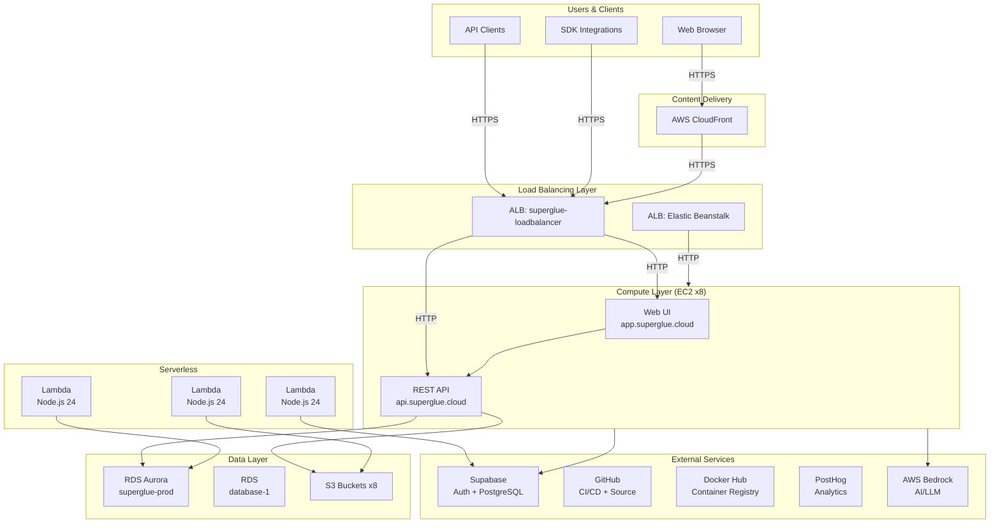

---

## 3. Application Architecture

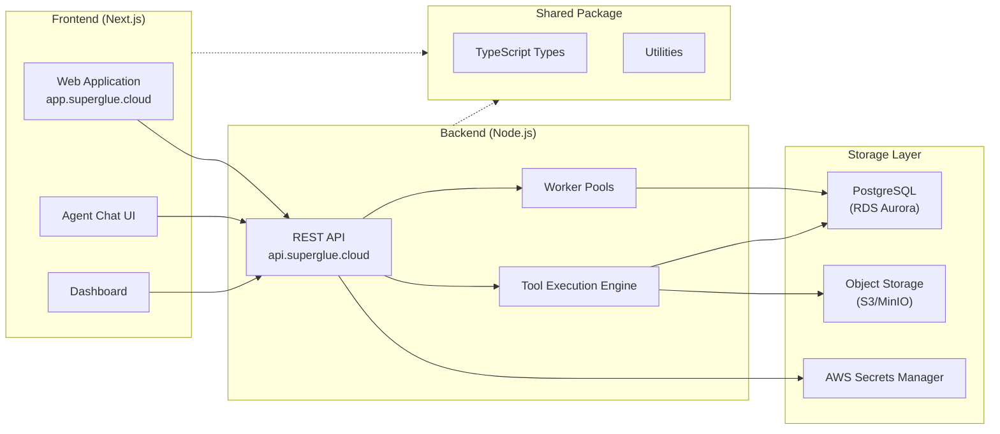

---

## 4. Data Communications Architecture

### 4.1 Network Flow Diagram

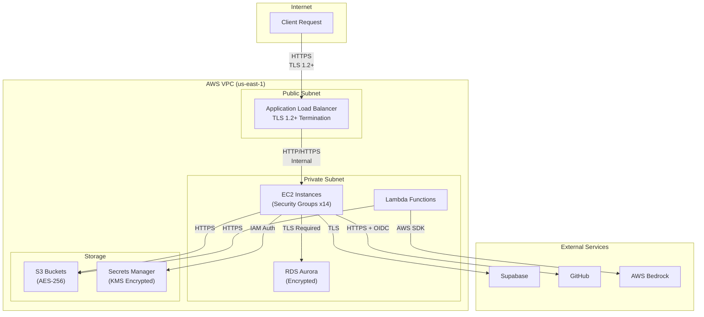

### 4.2 Data Flow Matrix

| Source | Destination | Protocol | Encryption | Port |
|--------|-------------|----------|------------|------|
| Client | ALB | HTTPS | TLS 1.2+ | 443 |
| ALB | EC2 | HTTP/HTTPS | Optional | 3001-3002 |
| EC2 | RDS Aurora | PostgreSQL | TLS Required | 5432 |
| EC2 | S3 | HTTPS | TLS + AES-256 | 443 |
| EC2 | Supabase | HTTPS | TLS 1.2+ | 443 |
| EC2 | Secrets Manager | HTTPS | TLS + KMS | 443 |
| Lambda | S3 | HTTPS | TLS + AES-256 | 443 |
| Lambda | Bedrock | HTTPS | TLS + AWS Auth | 443 |
| GitHub Actions | AWS | HTTPS | TLS + OIDC | 443 |

---

## 5. Security Architecture

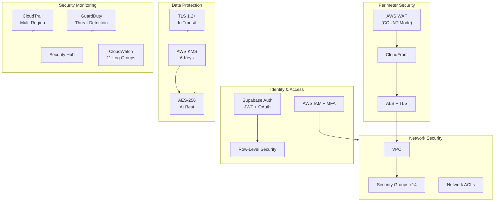

---

## 6. Infrastructure Components

### 6.1 AWS Resources

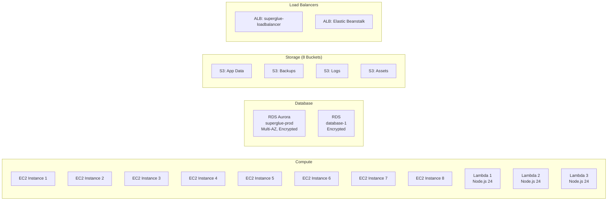

### 6.2 Resource Summary

| Service | Count | Configuration |
|---------|-------|---------------|
| Load Balancers (ALB) | 2 | TLS termination, health checks |
| EC2 Instances | 8 | SSH key auth, Security Groups |
| RDS Aurora | 2 | Encrypted (AES-256), Multi-AZ |
| S3 Buckets | 8 | AES-256 encryption (SSE-S3) |
| Lambda Functions | 3 | Node.js 24 runtime |
| Security Groups | 14 | VPC network isolation |
| KMS Keys | 6 | Key management |
| CloudWatch Log Groups | 11 | Centralized logging |

---

## 7. CI/CD Pipeline Architecture

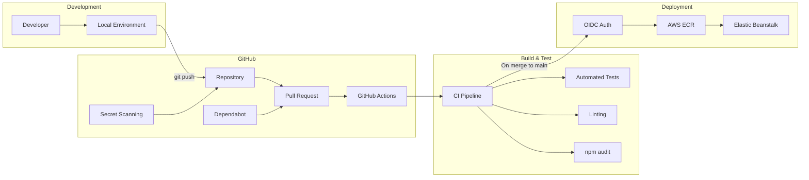

---

## 8. Authentication & Authorization Flow

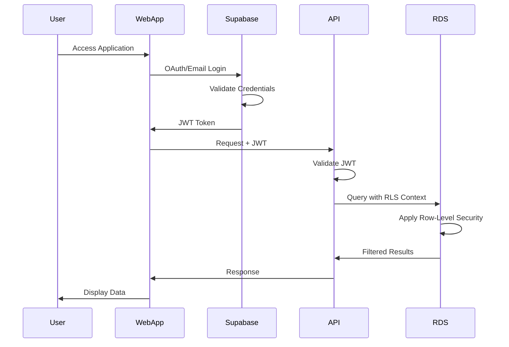

---

## 9. External Services Integration

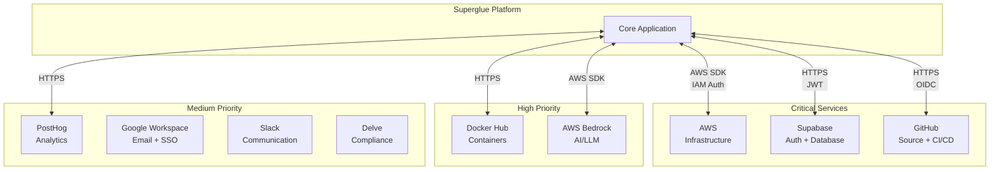

---

## 10. Encryption Architecture

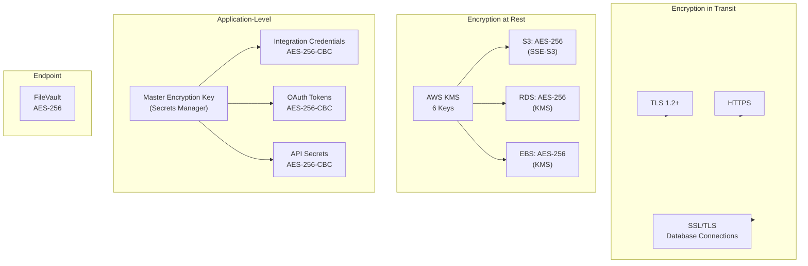

---

## 11. Disaster Recovery Architecture

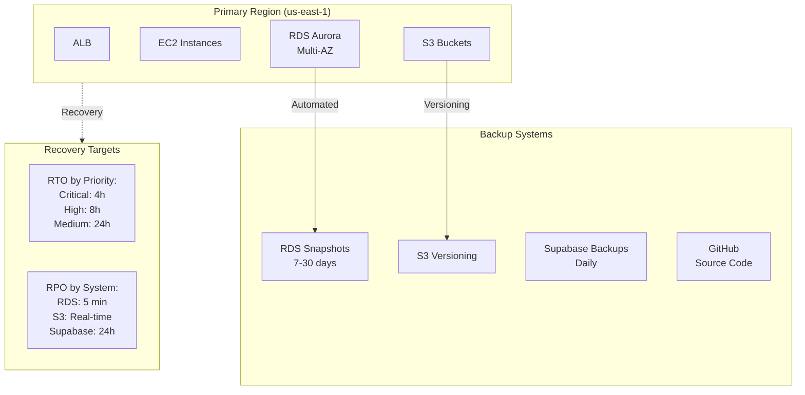

---

## 12. Monitoring Architecture

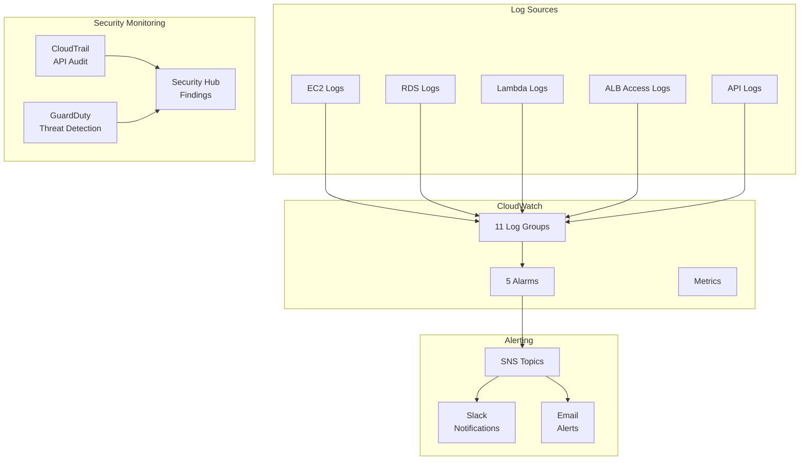

---

## 13. API Endpoints Summary

| Endpoint | Port | Protocol | Purpose |
|----------|------|----------|---------|
| `app.superglue.cloud` | 443 | HTTPS | Web Application (UI) |
| `api.superglue.cloud` | 443 | HTTPS | REST API |

---

## 14. Compliance Mapping

This architecture supports the following compliance frameworks:

| Framework | Relevant Controls |
|-----------|-------------------|
| **SOC 2 Type II** | CC6.1 (Logical Access), CC6.6 (Encryption), CC7.2 (Monitoring) |
| **GDPR** | Article 32 (Security of Processing), Article 25 (Data Protection by Design) |
| **CAIQ** | IVS (Infrastructure & Virtualization), CEK (Cryptography), IAM (Identity & Access) |

---

## Document Control

| Version | Date | Author | Changes |
|---------|------|--------|---------|
| 1.0 | February 2026 | Index Commerce GmbH | Initial release |

---
**Approved by:** Stefan Faistenauer (CTO) | **Next Review:** February 2027
