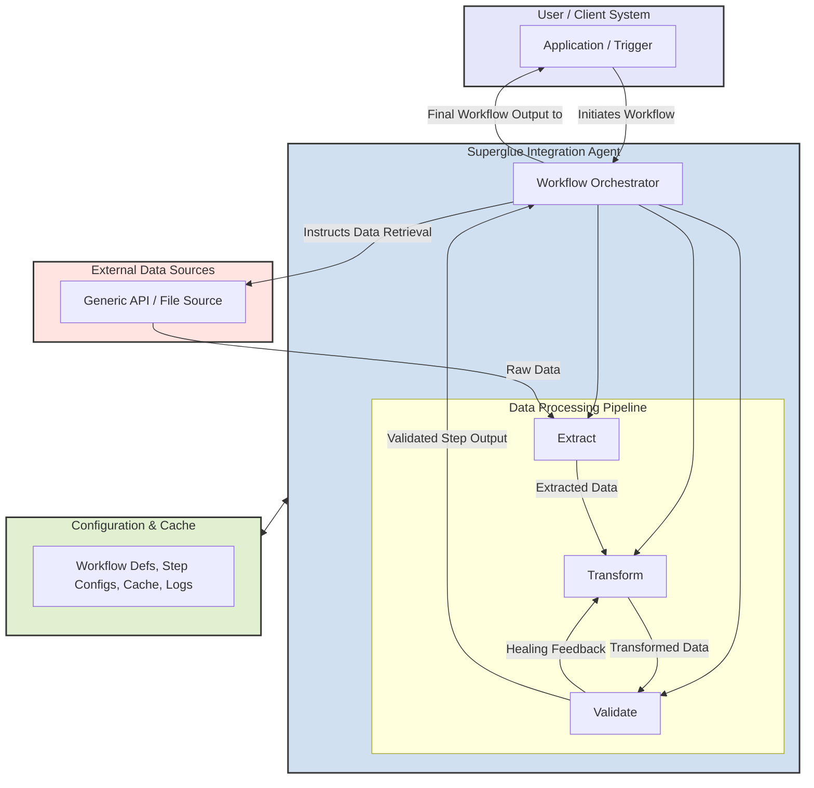

Superglue operates as a self-healing integration agent, designed to connect disparate systems and data sources through automated, multi-step workflows. It intelligently orchestrates data extraction, transformation, and validation, ensuring data arrives in your target systems in the correct format, even when source APIs change.

The following diagram illustrates the core components and a typical workflow data flow:

<Frame>

</Frame>

## Core Components
 
### External Systems / Data Sources
Superglue can connect to a wide array of external systems as steps within a workflow:
- **REST & GraphQL APIs**: Connects to any modern API, handling authentication, rate limiting, and pagination per step. Supports common authentication methods (OAuth, API keys, JWT tokens).
- **XML/JSON/CSV Files**: Processes structured data files from sources like local filesystems, S3 buckets, or remote URLs as part of a workflow step.
- **Legacy System Interfaces**: Interfaces with older systems (SOAP APIs, FTP) as defined in a workflow step.

### Superglue Integration Agent
This is the core of Superglue, responsible for executing integration workflows.

- **Workflow Engine / Orchestrator**:
  - Manages the execution of multi-step workflows defined by the user.
  - Sequences operations (API calls, data extractions, transformations) across different systems.
  - Passes data between workflow steps.
  - Handles overall workflow state, error handling, and retries for the workflow itself.

- **Core Capabilities (utilized by the Workflow Engine for each step)**:
  - **Extract Pipeline**:
    - Manages data extraction from the source specified in a workflow step (e.g., an API endpoint, a file URL).
    - Handles connection pooling, step-specific retry logic (default: 3 retries), and exponential backoff.
    - Supports rate limiting for API calls as configured for that step.
  - **LLM Transform Engine**:
    - Converts data from a source schema to a target schema for each relevant workflow step.
    - Uses LLMs (e.g., OpenAI, Gemini) to generate and refine JSONata transformation rules.
    - Caches successful transformation rules in Redis to ensure deterministic and efficient re-execution.
    - If schema validation fails (see below), this engine can be re-triggered to attempt a "self-heal" of the transformation rules.
  - **Schema Validator**:
    - Ensures data consistency and integrity for the output of each transformation step against a defined JSON Schema.
    - Provides field-level validation error messages.
    - If validation fails, it can trigger the LLM Transform Engine's self-healing process.

### Configuration & Cache (Persistent Store - e.g., Redis, File)
Superglue relies on persistent storage for its operational data:
- **Workflow Definitions**: Stores the structure of user-defined workflows, including the sequence of steps and their configurations.
- **API/Step Configurations**: Contains the specific configurations for each step within a workflow (e.g., `ApiConfig`, `ExtractConfig`, `TransformConfig` for individual API calls or file processing operations).
- **Transformation Cache (Mappings)**: Caches the generated JSONata transformation rules for quick and deterministic reuse.
- **Run Logs**: Stores execution logs for workflows and individual steps for monitoring and debugging.
Two main storage modes are supported:
- **Redis Mode**: Recommended for production. Persistent, supports clustering, and handles concurrent access.
- **File/In-Memory Mode**: Simpler options suitable for development/testing, with file mode offering basic persistence.

### User / Your Client System
- **Your Application**: The system that ultimately consumes the data processed by Superglue workflows or triggers these workflows.
- **Workflow Trigger**: Workflows can be initiated via an API call to Superglue or potentially through a scheduled mechanism.

## Data Flow (Workflow Example)

1.  A workflow is triggered (e.g., by an API call from 'Your Application' to Superglue).
2.  The **Workflow Engine** in Superglue loads the workflow definition.
3.  **For each step in the workflow** (e.g., calling API A, then API B using data from A):
    a.  The Orchestrator initiates the step, using the specific configuration for that step (e.g., an `ApiConfig` for calling API A).
    b.  The **Extract Pipeline** retrieves raw data from the external system (e.g., API A).
    c.  The **LLM Transform Engine** processes the raw data, applying cached or newly generated transformation rules to map it to the desired schema for that step.
    d.  The **Schema Validator** validates the transformed data. If it fails, it may trigger a feedback loop to the Transform Engine to attempt self-healing of the transformation rules.
    e.  The validated, transformed data from the current step becomes available as input for the next step in the workflow or as part of the final output.
4.  This process repeats for all steps in the workflow.
5.  The final output of the workflow is delivered to the designated target, such as 'Your Application' or another system specified in the workflow's concluding step.
6.  Status, metrics, and logs for the workflow and each step are recorded.

## Performance Characteristics
- Average transformation latency for an individual step with <100KB data: 10-50ms (when transformation rules are cached).
- Supports a high number of concurrent workflow executions, limited by underlying resources.
- Maximum payload size per step: 100MB (configurable).

## Security Implementation
- All external connections made by Superglue during workflow steps can be encrypted (e.g., TLS 1.3 for API calls).
- Credentials for accessing external systems within workflow steps are securely managed (e.g., stored encrypted if using Redis).
- Transformation logic for each step runs in isolated contexts.
- Rate limiting can be configured per API step.

## Monitoring Capabilities
- Prometheus metrics for core operations and workflow execution.
- Detailed logging with correlation IDs for workflows and individual steps.
- Error tracking with stack traces.
- Performance metrics for cache hit/miss ratios of transformation rules.

The implementation details for core capabilities like extraction and transformation can be found in the relevant utility modules within the codebase.

<CodeGroup>
```typescript packages/core/utils/extract.ts
startLine: 1
endLine: 40
```

```typescript packages/core/utils/transform.ts
startLine: 1
endLine: 35
```
</CodeGroup>

## Monitoring and Maintenance
- Built-in logging and monitoring capabilities for workflows and individual steps.
- Performance metrics collection.
- Error tracking and alerting.
- Easy configuration management for workflows and their constituent steps.