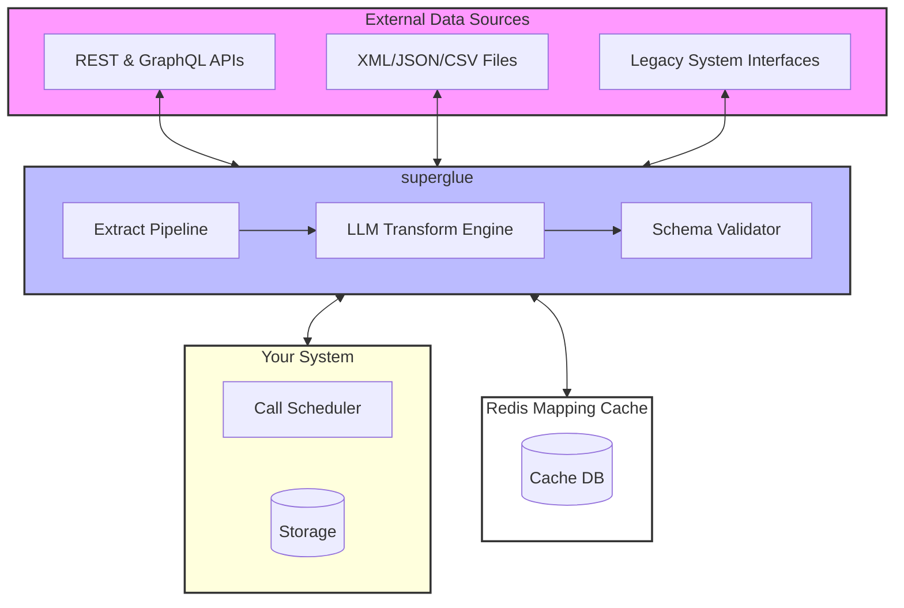

Superglue is built with a modular architecture that connects data sources to your software stack via a dedicated transformation layer and caching system. The following diagram illustrates the core components and data flow:



## Core Components

### External Data Sources

- **REST & GraphQL APIs**: Superglue can connect to any modern API endpoint, handling authentication, rate limiting, and pagination automatically. It supports common authentication methods like OAuth, API keys, and JWT tokens.

- **XML/JSON/CSV Files**: Process structured data files from various sources, including local filesystems, S3 buckets, or remote URLs. Superglue automatically handles parsing and data validation.

- **Legacy System Interfaces**: Connect to older systems through their available interfaces, including SOAP APIs, FTP servers, or custom protocols.

### Superglue Layer

- **Extract Pipeline**:
  - Manages the data extraction process from various sources
  - Handles connection pooling with configurable retry logic (default: 3 retries)
  - Implements exponential backoff starting at 1s with 2x multiplier
  - Supports rate limiting via Redis-based token bucket
  - Logs all extraction attempts with request/response details

- **LLM Transform Engine**:
  - Converts data between different schemas and formats
  - Supports multiple LLM providers:
    - OpenAI
    - Anthropic
    - Google Gemini
    - Mistral
    - xAI
    - DeepSeek
  - Uses LLMs to generate JSONata transformations
  - Caches successful transformations in Redis with 30-day TTL
  - Validates output against JSON Schema before returning
  - Handles nested object/array transformations up to 10 levels deep

- **Schema Validator**:
  - Ensures data consistency and integrity
  - Enforces JSON Schema validation on all transformed data
  - Provides field-level validation error messages
  - Supports custom validation rules via JSONata expressions
  - Validates required fields and data types

### Redis Cache
Two supported storage modes:

**Redis Mode**
- Persistent storage with 30-day TTL
- Supports cluster configuration
- Stores mappings, configurations and execution logs
- Implements key-based locking for concurrent access

**In-Memory Mode**
- Non-persistent storage using Map/Set data structures
- Suitable for development/testing
- Lower latency but no persistence
- Limited by available system memory

### Your System Integration

- **Call Scheduler**:
  - Manages the timing and frequency of data synchronization
  - Configurable webhook notifications for job status
  - Retry mechanism: 3 attempts with exponential backoff
  - Supports batch processing up to 1000 records
  - Implements circuit breaker pattern for failing endpoints

- **Storage**:
  - Your system's database where transformed data is stored
  - Supports any database with a JSON-compatible interface
  - Maintains atomic transactions for data consistency
  - Implements optimistic locking for concurrent updates
  - Buffers writes to reduce database load

## Data Flow

1. External data sources are accessed through their respective interfaces
2. The Extract Pipeline retrieves and normalizes the raw data
3. The LLM Transform Engine processes and maps the data to your required format
4. The Schema Validator ensures data quality and consistency
5. Processed data is cached in Redis if validation passes
6. Results are sent to target system via configured interface
7. Status and metrics are logged for monitoring

## Performance Characteristics

- Average transformation latency: 200-500ms
- Cache hit ratio: ~80% for repeated transformations
- Supports up to 100 concurrent transformations
- Maximum payload size: 100MB

## Security Implementation

- All external connections are encrypted using industry-standard protocols
- TLS 1.3 required for all external connections
- Credentials stored in Redis with AES-256 encryption
- Transformation runs in isolated Node.js worker threads
- Rate limiting per API key and IP address

## Monitoring Capabilities

- Prometheus metrics for all core operations
- Detailed logging with correlation IDs
- Error tracking with stack traces
- Performance metrics for cache hit/miss ratios

The implementation details can be found in the core utilities:

```typescript:packages/core/utils/extract.ts
startLine: 1
endLine: 40
```

```typescript:packages/core/utils/transform.ts
startLine: 1
endLine: 35
```

## Monitoring and Maintenance

- Built-in logging and monitoring capabilities
- Performance metrics collection
- Error tracking and alerting
- Easy configuration management and updates 