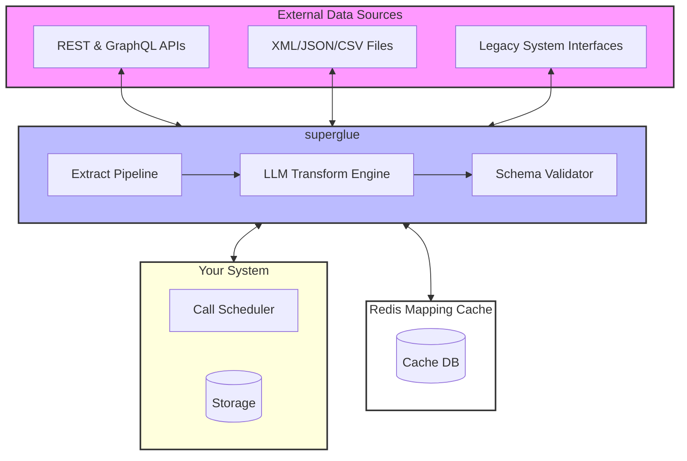

Superglue is built with a modular architecture that connects data sources to your software stack via a dedicated transformation layer and caching system. The following diagram illustrates the core components and data flow:

