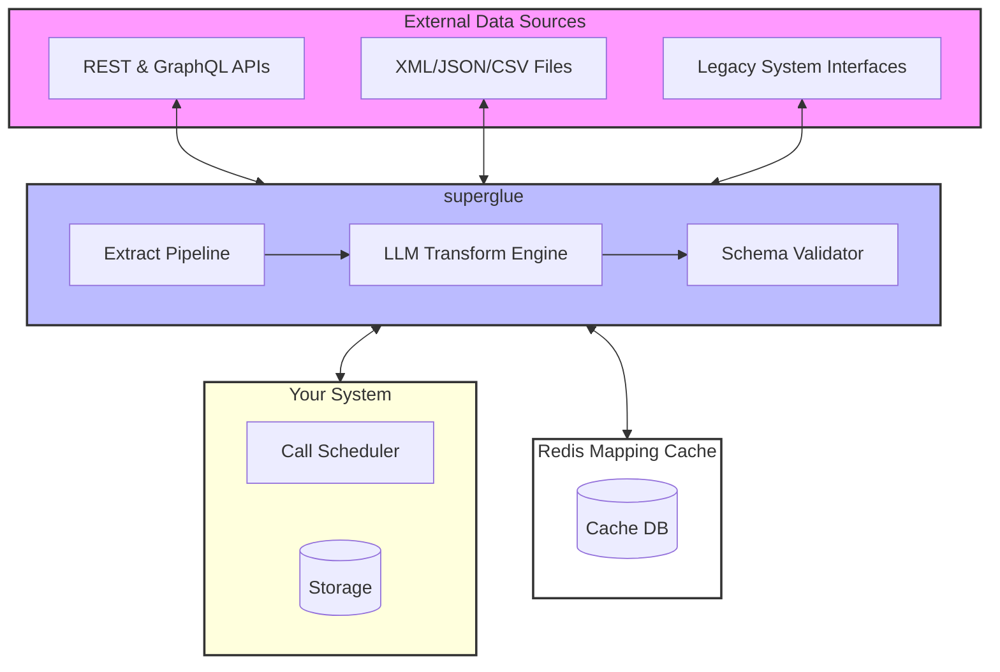

Superglue is built with a modular architecture that connects data sources to your software stack via a dedicated transformation layer and caching system. The following diagram illustrates the core components and data flow:

## Core Components

### External Data Sources

- **REST & GraphQL APIs**: Superglue can connect to any modern API endpoint, handling authentication, rate limiting, and pagination automatically. It supports common authentication methods like OAuth, API keys, and JWT tokens.

- **XML/JSON/CSV Files**: Process structured data files from various sources, including local filesystems, S3 buckets, or remote URLs. Superglue automatically handles parsing and data validation.

- **Legacy System Interfaces**: Connect to older systems through their available interfaces, including SOAP APIs, FTP servers, or custom protocols.

### Superglue Layer

- **Extract Pipeline**: 
  - Manages the data extraction process from various sources
  - Handles connection pooling and retry logic
  - Implements rate limiting and backoff strategies
  - Provides monitoring and logging of extraction processes

- **LLM Transform Engine**:
  - Converts data between different schemas and formats
  - Uses Large Language Models to understand and map complex data structures
  - Provides intelligent field mapping and data normalization
  - Handles edge cases and data inconsistencies

- **Schema Validator**:
  - Ensures data consistency and integrity
  - Validates transformed data against target schemas
  - Provides detailed error reporting
  - Supports custom validation rules

### Redis Mapping Cache

The Redis cache layer serves multiple purposes:
- Stores frequently accessed data to reduce API calls
- Caches transformation results for improved performance
- Maintains mapping rules and transformation patterns
- Provides fast access to temporary data during processing

### Your System Integration

- **Call Scheduler**:
  - Manages the timing and frequency of data synchronization
  - Handles webhook integrations
  - Coordinates batch processing jobs
  - Provides retry mechanisms for failed operations

- **Storage**:
  - Your system's database where transformed data is stored
  - Can be any supported database system (SQL, NoSQL, etc.)
  - Maintains data consistency with source systems

## Data Flow

1. External data sources are accessed through their respective interfaces
2. The Extract Pipeline retrieves and normalizes the raw data
3. The LLM Transform Engine processes and maps the data to your required format
4. The Schema Validator ensures data quality and consistency
5. Processed data is cached in Redis when appropriate
6. Your system receives the transformed data through the configured interfaces

## Performance Considerations

- Redis caching reduces API calls and improves response times
- The modular architecture allows for horizontal scaling of components
- Batch processing capabilities handle large data volumes efficiently
- Automatic retry mechanisms ensure reliable data delivery

## Security

- All external connections are encrypted using industry-standard protocols
- Authentication credentials are securely stored and managed
- Data transformation occurs in isolated environments
- Access controls can be implemented at multiple levels

## Monitoring and Maintenance

- Built-in logging and monitoring capabilities
- Performance metrics collection
- Error tracking and alerting
- Easy configuration management and updates 