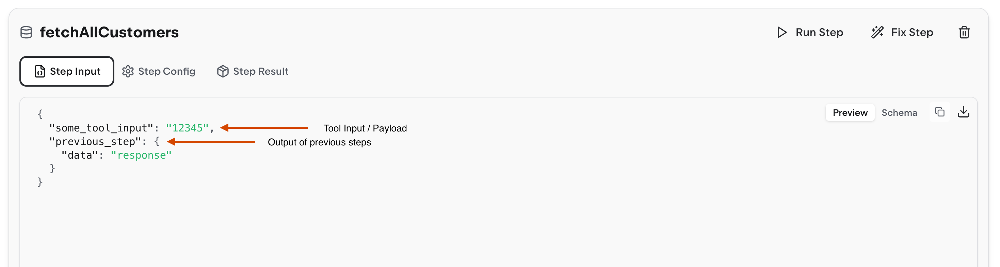
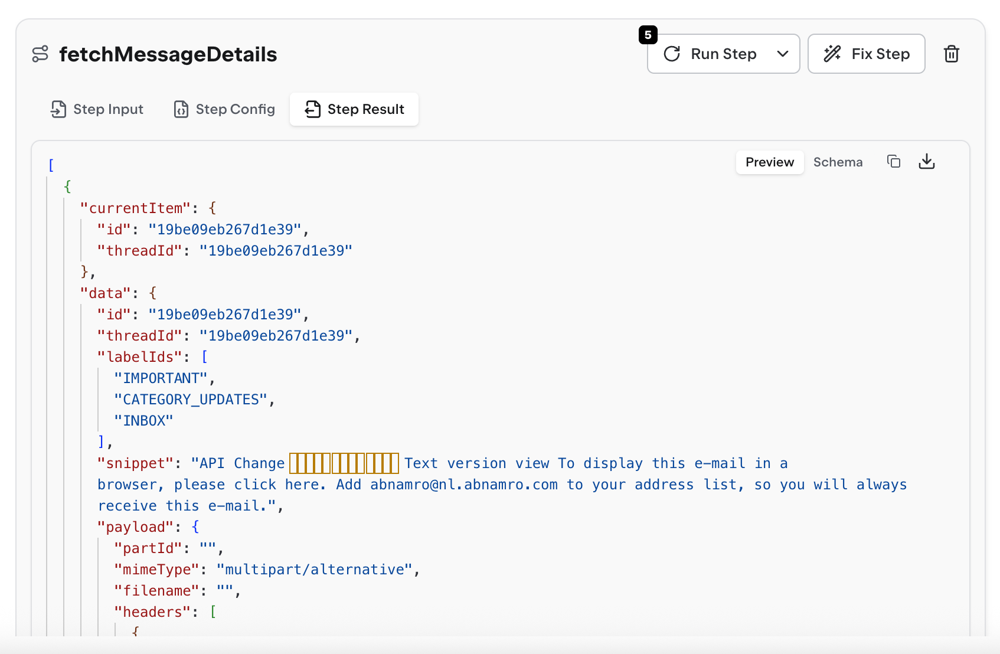
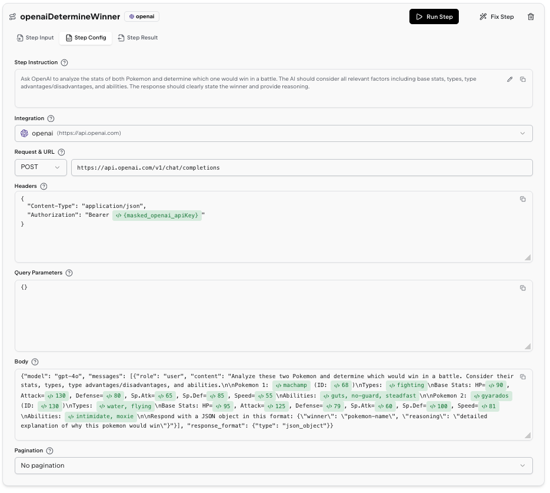

The tool playground is a developer-friendly interface for testing, debugging, and refining your tools. It provides granular control over execution and visibility into every step of your workflow.

## Tool Input

The playground starts with a **Tool Input** card where you define the data your tool will process.

<video autoPlay className="w-full rounded-lg">
  <source src="/resources/tool-input-demo.mp4" type="video/mp4" />
</video>

### Manual JSON Input

Enter JSON directly in the payload editor. The playground validates your input against the input schema (if defined) and highlights any validation errors.

```json
{
  "userId": "12345",
  "startDate": "2024-01-01"
}
```

If your tool has an input schema, the playground automatically generates a default payload as a starting point. You can edit this to match your test case.

### File Upload

Upload files to use as input data. The playground:

- Parses files automatically and adds them to your payload
- Shows file status (processing, ready, or error)
- Displays total file size
- Allows you to remove files

When you upload a file named `customers.csv`, it becomes available in your payload and subsequent steps as the `customers` variable.

### Schema Validation

The input card shows a red border if your payload doesn't match the input schema. Click "Run Anyway" to proceed despite validation errors, or fix your payload to match the schema requirements.

## Auto-Repair Mode (Self-Healing)

<video autoPlay className="w-full rounded-lg">
  <source src="/resources/auto-repair-demo.mp4" type="video/mp4" />
</video>

The **auto-repair** toggle in the header enables self-healing during execution. When enabled:

- The AI automatically fixes step configurations that fail
- API endpoints are corrected if they return errors
- Data transformations are adjusted to handle unexpected formats
- Step instructions are refined to match actual API responses

Auto-repair is slower but dramatically increases success rates for complex tools. Disable it when you want to see raw errors for debugging.

After a successful auto-repair run, the playground updates your step configurations automatically. You'll see a toast notification: "Tool configuration updated - auto-repair has modified the tool configuration to fix issues."

## Run All Steps

Click **Run All Steps** to execute your entire tool from start to finish. The playground:

- Executes steps sequentially
- Shows progress with a loading indicator on each step
- Marks completed steps with a green checkmark
- Marks failed steps with a red X
- Navigates to the first failure or final output when done

Click **Stop Execution** to halt the run after the current step completes.

## Inspect Step Inputs and Outputs

### Input Preview



The **Input** section displays the data passed into the step, including:

- Previous step results referenced in the instruction
- Original payload fields
- Processed file data

### Output Preview



After execution, the **Output** section shows:

- Successful API responses
- Error messages (with full stack traces for debugging)
- Data structure returned by the step

Click on nested objects to expand and inspect their contents. Use this to verify your step is receiving and returning the expected data structure.

## Step Configuration



### Step Instruction

Edit the natural language instruction that describes what the step should do. Once edited, rerun the step with "Fix Step" to apply changes. These are auto generated based on the tool-level instruction.

### Integration

Change which integration (API connection) the step uses. The playground validates that the selected integration exists. Note that this will change what credentials can be used.

## Run or Fix Individual Steps

<video autoPlay className="w-full rounded-lg">
  <source src="/resources/fix-step.mp4" type="video/mp4" />
</video>

### Run Step

Executes just this one step using the current configuration and previous step results. Use this to:

- Test changes to a single step without re-running the entire tool
- Debug a specific failure in isolation
- Verify your instruction changes work

### Fix Step

Runs the step with auto-repair enabled, even if global auto-repair is off. The AI attempts to fix the step configuration if it fails. Use this when:

- A step is failing and you want the AI to suggest a fix
- You've made manual changes but they're not working
- You have changed the instruction and want to align the API call with it

<Note>
  A fixed step will update the step configuration in the view but will not save
  it. You need to publish the tool to persist changes.
</Note>

## Final Transform

The **Final Transform** card contains JavaScript code that shapes your raw step outputs into the final result structure.

### Edit Transform Code

The transform receives `sourceData` containing all step results:

```javascript
(sourceData) => {
  return {
    users: sourceData.step_1.map((user) => ({
      id: user.id,
      name: user.full_name,
      email: user.email_address,
    })),
    total: sourceData.step_1.length,
  };
};
```

### Test Transform

Click **Run Transform Code** to execute your transform code against the current step results. This shows:

- The final output structure
- Any JavaScript errors in your transform
- Whether the output matches your response schema (if defined)

The transform runs in a sandboxed environment with access to common utilities. If it fails, the error message shows the exact line and issue.

### Response Schema

Define a JSON schema to validate your final output structure. The playground highlights schema violations and prevents invalid outputs from being returned.

## Debugging Workflow

When a tool fails, follow this workflow:

1. **Check the failed step** - Look at the step marked with a red X
2. **Inspect the error** - Read the error message in the Output section
3. **Review the input** - Verify the step received the expected data
4. **Try Fix Step** - Let auto-repair suggest a configuration change
5. **Edit instruction** - Manually refine the step instruction if needed
6. **Run Step** - Test your changes on just this step
7. **Run All Steps** - Verify the entire tool works end-to-end
