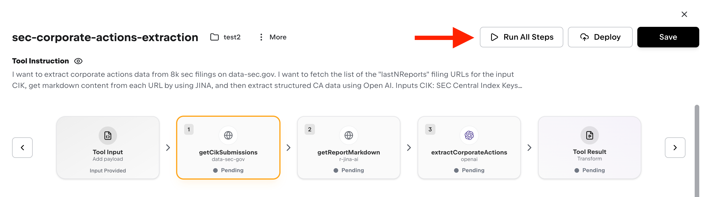

Once you've created a tool, you can deploy it in three ways: execute it on-demand, schedule it to run automatically, or trigger it via incoming webhooks from external services.

<Tabs>
  <Tab title="Via UI">
    Execute tools directly from the tool details page:

    

    <Steps>
      <Step title="Navigate to your tool">
        Go to Tools in your dashboard and select the tool you want to run
      </Step>
      <Step title="Provide input data">
        Enter any required input parameters in JSON format. If your tool doesn't require input, use `{}`
      </Step>
      <Step title="Execute">
        Click "Run All Steps" to execute immediately. You'll see real-time logs and step-by-step progress
      </Step>
      <Step title="Review results">
        Check the output data and individual step results. All executions are logged for debugging.
      </Step>
    </Steps>

  </Tab>
  <Tab title="Via SDK">
    For programmatic execution, use the REST SDK:

    ```bash
    npm install @superglue/client
    ```

    **Run a saved tool:**

    ```typescript
    import { configure, runTool, getRun, listRuns } from "@superglue/client";

    // Configure the SDK
    configure({
      baseUrl: "https://api.superglue.cloud", // or your self-hosted URL
      apiKey: "your_api_key"
    });

    // Run a tool with input payload
    const { data: run } = await runTool("sync-customers", {
      inputs: {
        startDate: "2025-01-01",
        userId: "user_123"
      }
    });

    // For synchronous runs, result is available immediately
    if (run.status === "success") {
      console.log(run.data); // Final output
      console.log(run.stepResults); // Step-by-step details
    }
    ```

    **Run asynchronously and poll for results:**

    ```typescript
    // Start an async run
    const { data: run } = await runTool("sync-customers", {
      inputs: { startDate: "2025-01-01" },
      options: { async: true }
    });

    // Poll for completion
    let status = run.status;
    while (status === "running") {
      await new Promise(r => setTimeout(r, 1000));
      const { data: updated } = await getRun(run.runId);
      status = updated.status;
      if (status === "success") {
        console.log(updated.data);
      }
    }
    ```

    **List recent runs:**

    ```typescript
    const response = await listRuns({ 
      toolId: "sync-customers",
      limit: 10 
    });
    
    response.data.data.forEach(run => {
      console.log(`${run.runId}: ${run.status}`);
    });
    ```

    **Pass credentials at runtime:**

    ```typescript
    const { data: run } = await runTool("sync-customers", {
      inputs: { userId: "user_123" },
      credentials: {
        stripe_api_key: "sk_live_xxx",
        hubspot_access_token: "pat-xxx"
      }
    });
    ```

  </Tab>
</Tabs>

## Enterprise deployment options

superglue Enterprise offers additional deployment capabilities for automated and event-driven execution:

<CardGroup cols={2}>
  <Card title="Scheduled Execution" icon="clock" href="/enterprise/scheduling">
    Automate tool runs with cron-based scheduling. Run tools at specific times or intervals.
  </Card>
  <Card title="Incoming Webhooks" icon="webhook" href="/enterprise/webhooks">
    Trigger tools from external services like Stripe, GitHub, or Shopify via HTTP webhooks.
  </Card>
</CardGroup>
