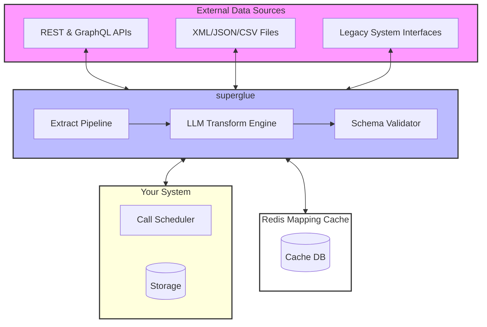

# Welcome to Superglue 🍯

Superglue is an API translator that extracts, maps, and transforms data into the format your system needs. By leveraging the power of large language models, Superglue makes it simple to integrate and transform data from various sources with just one line of code.

## Overview

Superglue simplifies data workflows by providing:

- **Lightweight ETL**: Efficiently extract, transform, and load data with minimal overhead.
- **One Line of Code Integration**: Quickly integrate Superglue into your application.
- **LLM-Powered Data Mapping**: Automatically generate data transformations using advanced language models.
- **API Proxy**: Seamlessly intercept and modify API responses in real-time.
- **Flexible Authentication**: Supports header-based auth, API keys, OAuth2, and more.
- **Smart Pagination**: Automatically handle a variety of pagination strategies.
- **Caching & Retry Logic**: Achieve robust performance with built-in caching and retry mechanisms.

## Architecture

Superglue is built with a modular architecture that connects data sources to your software stack via a dedicated transformation layer and caching system. The following diagram illustrates the core components and data flow:



## Getting Started

You can use Superglue either as a hosted service or deploy it yourself using Docker.

### Hosted Version

1. **Sign Up for Early Access**  
   Visit [superglue.cloud](https://superglue.cloud) to request early access to the hosted version.

2. **Install the Client SDK**  
   Install the Superglue JavaScript/TypeScript client:

   ```bash
   npm install @superglue/superglue
   ```

3. **Configure Your First API Call**  
   Create a basic API call configuration:

   ```javascript
   import { SuperglueClient } from "@superglue/superglue";

   const superglue = new SuperglueClient({
     apiKey: "YOUR_API_KEY"
   });

   const config = {
     urlHost: "https://futuramaapi.com",
     urlPath: "/graphql",
     instruction: "get all characters from the show",
     responseSchema: {
       type: "object",
       properties: {
         characters: {
           type: "array",
           items: {
             type: "object",
             properties: {
               name: { type: "string" },
               species: { type: "string", description: "lowercased" }
             }
           }
         }
       }
     }
   };

   const result = await superglue.call({ endpoint: config });
   console.log(JSON.stringify(result.data, null, 2));
   ```

### Self-Hosted Version

Deploy your own instance of Superglue for complete control.

1. **Pull the Docker Image**

   ```bash
   docker pull superglueai/superglue
   ```

2. **Create an Environment File**  
   Create a `.env` file with the following configuration:

   ```env
   # Server Configuration
   GRAPHQL_PORT=3000             # Port for the Superglue server
   WEB_PORT=3001                 # Port for the web dashboard
   AUTH_TOKEN=your-auth-token    # Token for API access

   # Datastore Configuration (choose one)
   DATASTORE_TYPE=redis          # Use "redis" for persistent storage or "memory" for quick setups

   # If using Redis:
   REDIS_HOST=localhost
   REDIS_PORT=6379
   REDIS_USERNAME=default
   REDIS_PASSWORD=secret

   # OpenAI Configuration
   OPENAI_API_KEY=sk-...         # Your OpenAI API key
   OPENAI_MODEL=gpt-4o-2024-11-20 # Recommended OpenAI model
   ```

3. **Start the Superglue Server**

   Run the Docker container:

   ```bash
   docker run -d \
     --name superglue \
     --env-file .env \
     -p 3000:3000 \
     -p 3001:3001 \
     superglueai/superglue
   ```

4. **Verify the Installation**

   Confirm that the server is running:

   ```bash
   curl http://localhost:3000/health
   ```

   You should see:

   ```plaintext
   OK
   ```

5. **Access the Dashboard**  
   Open your browser at [http://localhost:3001/](http://localhost:3001/) to create and manage API configurations.

6. **Local API Call Example**

   Use the client SDK to execute an API call against your local instance:

   ```javascript
   import { SuperglueClient } from "@superglue/superglue";

   const superglue = new SuperglueClient({
     endpoint: "http://localhost:3000",
     apiKey: "your-auth-token"
   });

   const config = {
     urlHost: "https://futuramaapi.com",
     urlPath: "/graphql",
     instruction: "get all characters from the show",
   };

   const result = await superglue.call({ endpoint: config });
   console.log(JSON.stringify(result.data, null, 2));
   ```

## Requirements

- **Docker**: Version 20.10.0 or higher (when self-hosting).
- **Redis**: Version 6.0 or higher (for persistent storage).
- **OpenAI API Key**: Access to the recommended OpenAI model (e.g., gpt-4o-2024-11-20).

## Key Features Recap

- **LLM-Powered Data Mapping**: Automatically generate data transformations with LLMs.
- **Real-Time API Proxy**: Intercept and modify API responses instantly.
- **File Processing**: Support for CSV, JSON, XML, and automatic decompression.
- **Schema Validation**: Validate responses against defined JSON schemas.
- **Flexible Authentication**: Integrates various authentication methods.
- **Smart Pagination**: Manages multiple pagination strategies effortlessly.
- **Caching & Retry Logic**: Enhances performance with built-in caching and retry strategies.

## License

Superglue is licensed under the GNU General Public License (GPL) for the core product while the client SDKs are MIT licensed. See [LICENSE](LICENSE) for more details.

## Support

If you need help or want to contribute, please reach out via:

- **Email**: stefan@superglue.cloud
- **Discord**: [Join our community](https://discord.gg/SKRYYQEp)
- **GitHub Issues**: [Report issues or contribute](https://github.com/superglue-ai/superglue/issues)

---

Superglue is designed to make data transformation and API integration effortless. Start building smarter applications today with one simple integration.
