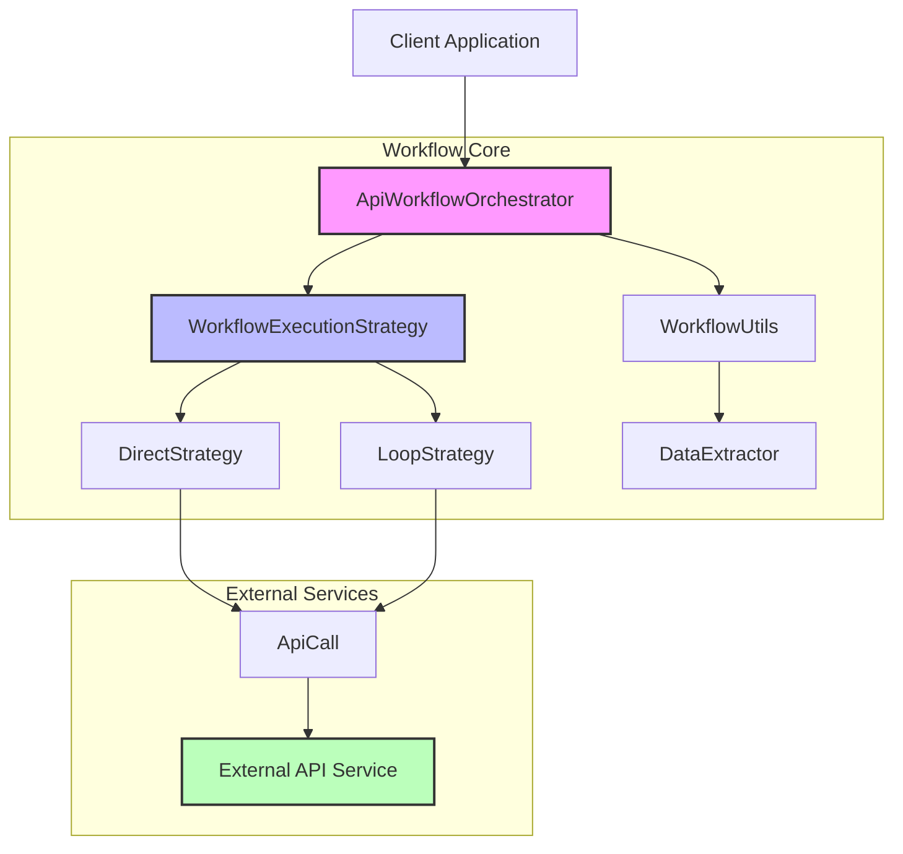
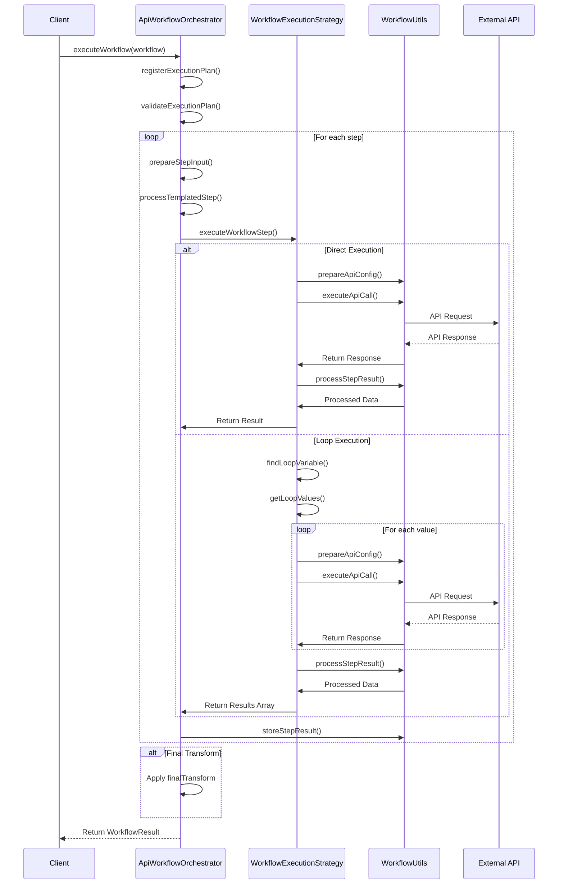
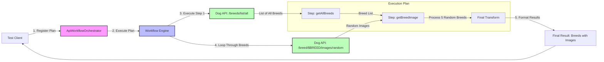
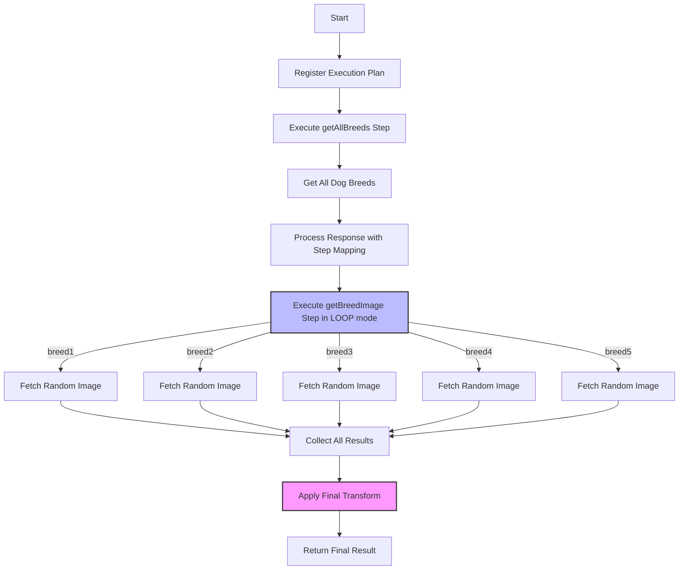

# Workflow Component

The Workflow Component enables chaining multiple API calls together to achieve complex data transformations and retrieval patterns. It orchestrates a sequence of API operations where the output of one step can feed into subsequent steps, allowing data to flow through a defined pipeline.

## Architecture Overview



## Workflow Execution Flow



## Dog API Example (based on simple-dog.test.ts)



## Data Flow in Dog API Example



## Key Components

### ApiWorkflowOrchestrator

The main entry point for workflow execution that:
- Manages execution plans
- Validates workflow definitions
- Coordinates step execution
- Applies final transformations
- Handles error states

### Execution Strategies

#### DirectStrategy
- Executes a single API call for a step
- Resolves template variables from previous steps
- Processes and stores results

#### LoopStrategy
- Identifies loop variables and their sources
- Executes the same API call for each value in an array
- Manages collection of results from multiple iterations
- Supports limits on loop iterations

### DataExtractor
- Extracts data from complex objects using JSONata expressions
- Finds values by key in nested data structures
- Handles array transformations

### WorkflowUtils
- Processes template strings ({variable})
- Executes API calls
- Transforms API responses using step mappings
- Stores step results in the workflow context

## Workflow Definition Structure

```typescript
interface ExecutionPlan {
  id: string;
  apiHost: string;
  steps: ExecutionStep[];
  finalTransform?: string; // JSONata expression
}

interface ExecutionStep {
  id: string;
  apiConfig: ApiConfig;
  executionMode: "DIRECT" | "LOOP";
  
  // Optional configurations
  outputIsArray?: boolean;
  loopVariable?: string;
  loopMaxIters?: number;
  responseField?: string;
  objectKeysAsArray?: boolean;
  
  inputMapping: string; // JSONata expression, defaults to "$"
  responseMapping: string; // JSONata expression, defaults to "$"
}
```

## Example Usage

```typescript
// Define a workflow execution plan
const executionPlan = {
  id: "dog-workflow",
  apiHost: "https://dog.ceo/api",
  steps: [
    {
      id: "getAllBreeds",
      apiConfig: {
        id: "getAllBreeds_config",
        urlHost: "https://dog.ceo/api",
        urlPath: "/breeds/list/all",
        instruction: "Get all dog breeds",
        method: "GET"
      },
      executionMode: "DIRECT",
      responseField: "message",
      objectKeysAsArray: true,
      inputMapping: "$",
      responseMapping: "$"
    },
    {
      id: "getBreedImage",
      apiConfig: {
        id: "getBreedImage_config",
        urlHost: "https://dog.ceo/api",
        urlPath: "/breed/{breed}/images/random",
        instruction: "Get a random image for a specific dog breed",
        method: "GET"
      },
      executionMode: "LOOP",
      loopVariable: "breed",
      loopMaxIters: 5,
      inputMapping: "$",
      responseMapping: "$"
    }
  ],
  finalTransform: `{
    "breeds": $map(
      $filter(
        $keys($.getAllBreeds.message),
        function($b) {
          $count($.getBreedImage[$split(message, "/")[4] = $b]) > 0
        }
      ),
      function($b) {
        {
          $b: $.getBreedImage[$split(message, "/")[4] = $b].message[0]
        }
      }
    )
  }`
};

// Execute the workflow
const orchestrator = new ApiWorkflowOrchestrator(baseApiInput);
const planId = await orchestrator.registerExecutionPlan(executionPlan);
const result = await orchestrator.executeWorkflowPlan(planId, payload, credentials);
```
