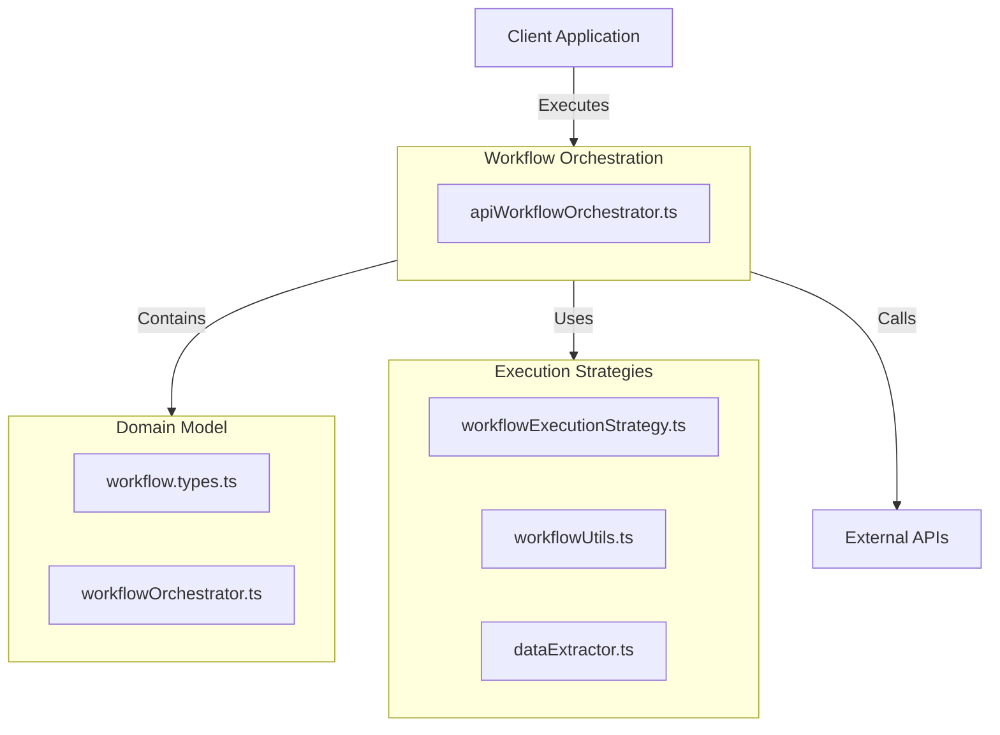
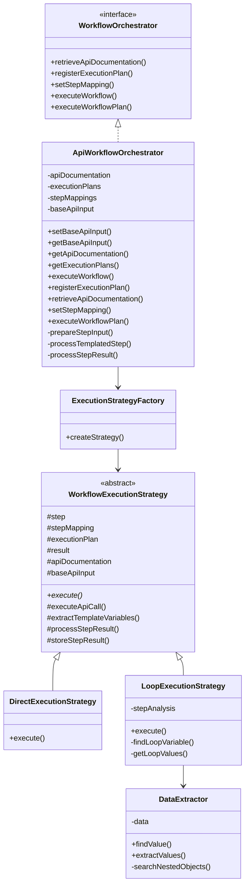
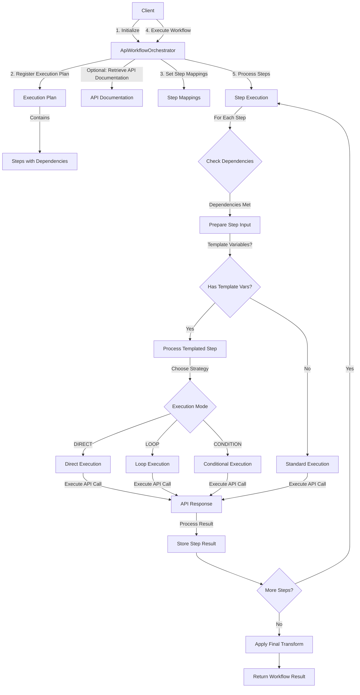
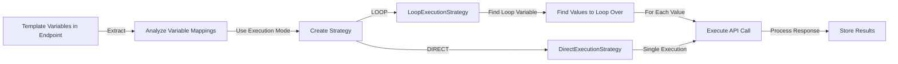
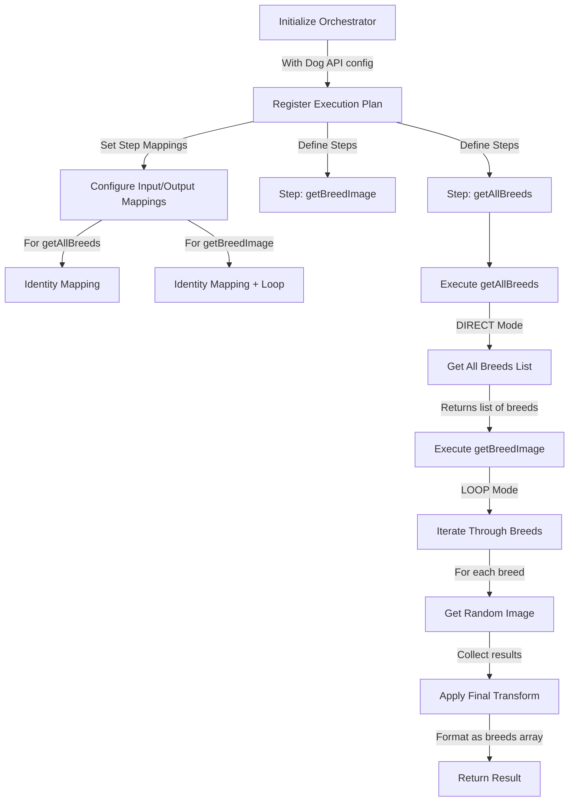

# Workflow README

This module provides a workflow orchestration system for executing multi-step API workflows.

## High-Level Overview

## Core Components

## Workflow Architecture

## Templated Step Processing

## Execution Flow

1. **Initialize the Orchestrator**: Create an instance with base API configuration
2. **Register Execution Plan**: Define steps, dependencies, and transforms
3. **Set Step Mappings**: Configure input/output mappings for each step
4. **Execute Workflow**: Run the workflow with input payload and credentials
5. **Process Steps**: For each step:
   - Check dependencies are met
   - Prepare input based on mappings and prior steps
   - Process templated variables if present
   - Execute using appropriate strategy (DIRECT, LOOP, CONDITION)
   - Store step results for subsequent steps
6. **Apply Final Transform**: Process all step results into final output format
7. **Return Result**: Provide complete workflow results

## Example: Dog API Workflow

The `simple-dog.test.ts` demonstrates a workflow with the Dog API:

### Execution Mode Strategies

- **DIRECT**: Simple one-time execution of the API call
- **LOOP**: Executes the step multiple times, iterating over a collection
- **CONDITION**: Executes the step only if a condition is met

### Variable Mapping

Template variables in endpoints (like `${breed}`) are automatically matched with:
1. Values from dependent step results
2. Values from the original payload
3. Custom mappings defined in the step configuration

The orchestrator analyzes the variables to determine the best mapping strategy for each step's execution mode.
