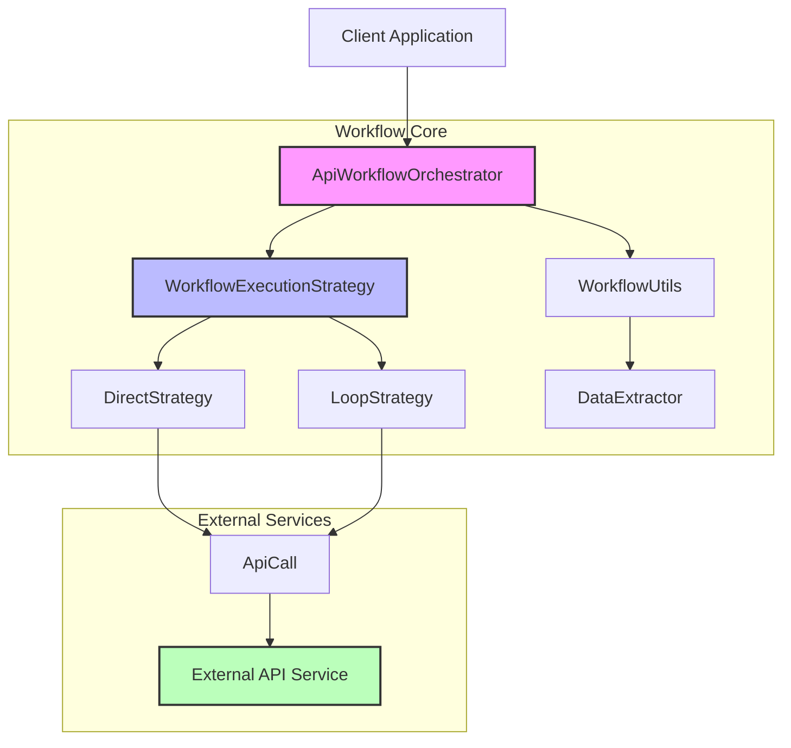
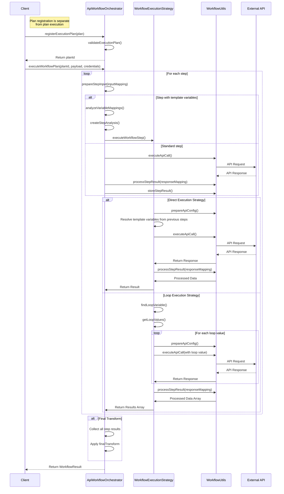

# Workflow Component

The Workflow Component enables chaining multiple API calls together to achieve complex data transformations and retrieval patterns. It orchestrates a sequence of API operations where the output of one step can feed into subsequent steps, allowing data to flow through a defined pipeline.

## Architecture Overview



## Workflow Execution Flow



## Dog API Example (based on simple-dog.test.ts)

```mermaid
graph LR
    Client[Test Client] --> |1. Register Plan| Orchestrator[ApiWorkflowOrchestrator]
    Orchestrator --> |2. Execute Plan| ExecutionEngine[Workflow Engine]
    
    subgraph "Execution Plan"
        subgraph "Step 1: getAllBreeds"
            Step1Config[apiConfig: GET /breeds/list/all]
            Step1Mapping[responseMapping: keys-message]
        end
        
        subgraph "Step 2: getBreedImage"
            Step2Config[apiConfig: GET /breed/{breed}/images/random]
            Step2Loop[executionMode: LOOP<br>loopVariable: breed<br>loopMaxIters: 5]
        end
        
        FinalTransform[finalTransform: Format breeds with images]
        
        Step1Config --> Step1Mapping
        Step1Mapping --> |Provides breed names| Step2Loop
        Step2Loop --> |Process breed images| FinalTransform
    end
    
    ExecutionEngine --> |3. Execute Step 1| DogAPI1[Dog API: /breeds/list/all]
    DogAPI1 --> |JSON Response| Step1Config
    Step1Mapping --> |Extracted breed names| Data1[Transformed Data]
    
    Data1 --> |Loop through breeds| Step2Loop
    Step2Loop --> |For each breed| DogAPI2[Dog API: /breed/{breed}/images/random]
    DogAPI2 --> |Random Images| Data2[Image URLs]
    
    Data1 --> |Step Results| TransformInput[Input to Transform]
    Data2 --> |Step Results| TransformInput
    TransformInput --> |Apply JSONata Expression| FinalTransform
    
    FinalTransform --> |5. Format Results| Result[Final Result: Breed-Image Pairs]
    
    Result --> Client
    
    style Orchestrator fill:#f9f,stroke:#333,stroke-width:2px
    style ExecutionEngine fill:#bbf,stroke:#333,stroke-width:2px
    style DogAPI1 fill:#bfb,stroke:#333,stroke-width:2px
    style DogAPI2 fill:#bfb,stroke:#333,stroke-width:2px
    style Step1Mapping fill:#cce,stroke:#333,stroke-width:2px
    style Step2Loop fill:#cce,stroke:#333,stroke-width:2px
    style FinalTransform fill:#ecb,stroke:#333,stroke-width:2px
```

## Data Flow in Dog API Example

```mermaid
flowchart TD
    A[Start] --> B[Register Execution Plan]
    B --> D[Execute getAllBreeds Step]
    D --> E[Dog API: GET /breeds/list/all]
    E --> |API Response| F1[Raw Response]
    F1 --> |Apply responseMapping: keys-message| F2[Transform Response]
    F2 --> |Store Result| F3[Step Result Storage]
    
    F3 --> G[Execute getBreedImage Step in LOOP mode]
    G --> |Analyze Loop Variable| G1[Find 'breed' variable]
    G1 --> |Extract values from previous step| G2[Get breed names]
    G2 --> |Apply loopMaxIters=5| G3[Limit to 5 breeds]
    
    G3 --> |breed1| H1[Dog API: GET /breed/{breed}/images/random]
    G3 --> |breed2| H2[Dog API: GET /breed/{breed}/images/random]
    G3 --> |breed3| H3[Dog API: GET /breed/{breed}/images/random]
    G3 --> |breed4| H4[Dog API: GET /breed/{breed}/images/random]
    G3 --> |breed5| H5[Dog API: GET /breed/{breed}/images/random]
    
    H1 --> |API Response| I1[Process Response 1]
    H2 --> |API Response| I2[Process Response 2]
    H3 --> |API Response| I3[Process Response 3]
    H4 --> |API Response| I4[Process Response 4]
    H5 --> |API Response| I5[Process Response 5]
    
    I1 --> I[Collect All Results]
    I2 --> I
    I3 --> I
    I4 --> I
    I5 --> I
    
    I --> |Store in step results| J1[Step Result Storage]
    J1 --> |Apply finalTransform| J2[Transform data]
    J2 --> |Create final result| K[Return Final Result]
    
    subgraph "Data Flow"
    F1 --> F2 --> F3
    end
    
    style G fill:#bbf,stroke:#333,stroke-width:2px
    style J2 fill:#f9f,stroke:#333,stroke-width:2px
    style F2 fill:#cce,stroke:#333,stroke-width:2px
    style G2 fill:#cce,stroke:#333,stroke-width:2px
```

## Key Components

### ApiWorkflowOrchestrator

The main entry point for workflow execution that:
- Manages execution plans
- Validates workflow definitions
- Coordinates step execution
- Applies final transformations
- Handles error states

### Execution Strategies

#### DirectStrategy
- Executes a single API call for a step
- Resolves template variables from previous steps
- Processes and stores results

#### LoopStrategy
- Identifies loop variables and their sources
- Executes the same API call for each value in an array
- Manages collection of results from multiple iterations
- Supports limits on loop iterations

### DataExtractor
- Extracts data from complex objects using JSONata expressions
- Finds values by key in nested data structures
- Handles array transformations

### WorkflowUtils
- Processes template strings ({variable})
- Executes API calls
- Transforms API responses using step mappings
- Stores step results in the workflow context

## Workflow Definition Structure

```typescript
interface ExecutionPlan {
  id: string;
  steps: ExecutionStep[];
  finalTransform?: string; // JSONata expression
}

interface ExecutionStep {
  id: string;
  apiConfig: ApiConfig;
  executionMode: "DIRECT" | "LOOP";
  
  // Optional configurations
  loopVariable?: string;
  loopMaxIters?: number;
  
  inputMapping?: string; // JSONata expression, defaults to "$"
  responseMapping?: string; // JSONata expression, defaults to "$"
}
```

## Example Usage

```typescript
// Define a workflow execution plan
const executionPlan = {
  id: "dog-workflow",
  steps: [
    {
      id: "getAllBreeds",
      apiConfig: {
        id: "getAllBreeds_config",
        urlHost: "https://dog.ceo/api",
        urlPath: "/breeds/list/all",
        instruction: "Get all dog breeds",
        method: "GET"
      },
      executionMode: "DIRECT",
      inputMapping: "$",
      responseMapping: "$keys($.message)" // Extract the keys (breed names) from the message object
    },
    {
      id: "getBreedImage",
      apiConfig: {
        id: "getBreedImage_config",
        urlHost: "https://dog.ceo/api",
        urlPath: "/breed/{breed}/images/random",
        instruction: "Get a random image for a specific dog breed",
        method: "GET"
      },
      executionMode: "LOOP",
      loopVariable: "breed",
      loopMaxIters: 5,
      inputMapping: "$", // Use identity mapping since loopVariable will handle extracting values
      responseMapping: "$"
    }
  ],
  finalTransform: `{
    "breeds": $map(
      $filter(
        $keys($.getAllBreeds.message),
        function($b) {
          $count($.getBreedImage[$split(message, "/")[4] = $b]) > 0
        }
      ),
      function($b) {
        {
          $b: $.getBreedImage[$split(message, "/")[4] = $b].message[0]
        }
      }
    )
  }`
};

// Execute the workflow
const orchestrator = new ApiWorkflowOrchestrator(baseApiInput);
const planId = await orchestrator.registerExecutionPlan(executionPlan);
const result = await orchestrator.executeWorkflowPlan(planId, payload, credentials);
```
